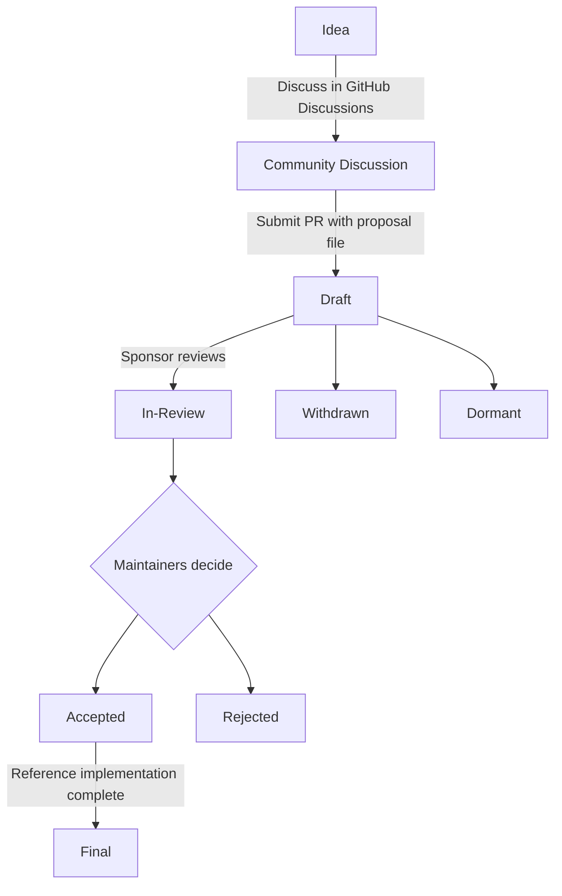

# Proposal Guidelines

## What is an Enhancement Proposal?

An Enhancement Proposal is a design document providing information to the S.DEF community, or describing a new feature for the format or its processes. The proposal provides a concise technical specification and a rationale for the feature.

Proposals are the primary mechanism for proposing major new features, collecting community input, and documenting design decisions.

Proposals are maintained as markdown files in the [`proposals/` directory](https://github.com/cleanroom-agent/S.DEF/tree/main/proposals) of the specification repository.

## When to Write a Proposal

The proposal process is reserved for changes that require broad community discussion, a formal design document, and a historical record.

**Write a proposal if your change involves:**

- A new schema type or field
- A breaking change to the format
- A governance or process change
- A complex or controversial topic

**Skip the proposal process for:**

- Bug fixes and typo corrections
- Documentation clarifications
- Adding examples to existing features
- Minor schema clarifications that don't change behavior

## Proposal Types

1. **Standards Track** - Describes a new feature for the S.DEF format or an interoperability standard
2. **Informational** - Describes a design issue or provides guidelines without proposing a new feature
3. **Process** - Describes or changes a process

## Proposal Workflow

## Step-by-Step Process

1. **Discuss your idea** first in GitHub Discussions. This is the best way to refine your proposal and build early support.

2. **Draft your proposal** as a markdown file named `0000-your-feature-title.md`, using `0000` as a placeholder. Follow the [proposal format](#proposal-format).

3. **Create a pull request** adding your proposal file to the `proposals/` directory.

4. **Update the proposal number**: Once your PR is created, rename the file using the PR number (e.g., PR #42 becomes `0042-your-feature-title.md`) and update the header.

5. **Find a Sponsor**: Tag a maintainer from the maintainer list to champion your proposal.

6. **Review**: The sponsor reviews and may request changes. When ready, the status moves to `in-review`.

7. **Resolution**: The proposal may be `accepted`, `rejected`, or returned for revision.

8. **Finalization**: Once accepted and implemented, the status moves to `final`.

## Proposal Format

See the [proposal template](https://github.com/cleanroom-agent/S.DEF/blob/main/proposals/TEMPLATE.md) for the complete file structure.

Each proposal must include:

1. **Preamble** - Title, author, status, type, PR number
2. **Summary** - ~200 word technical summary
3. **Motivation** - Why the change is needed
4. **Specification** - Technical detail of the proposed changes
5. **Rationale** - Why design decisions were made
6. **Backward Compatibility** - Impact on existing documents
7. **Security Implications** - Any security concerns

## The Sponsor Role

A Sponsor is a maintainer who champions the proposal through the review process:

- Reviewing and providing feedback
- Updating the proposal status
- Initiating formal review
- Ensuring quality standards

## After Rejection

Rejection is not permanent. You can:

- Address the feedback and resubmit
- Discuss the rejection to understand reasoning
- Submit a competing proposal with a different approach
